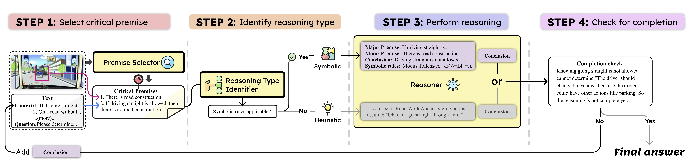
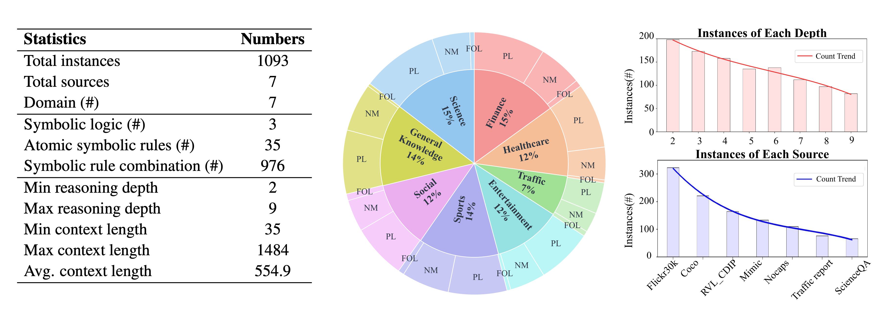

# MuSLR: Multimodal Symbolic Logical Reasoning

Coda and Data for NeurIPS 2025 Paper ["Multimodal Symbolic Logical Reasoning"](https://nips.cc/virtual/2025/poster/115490).
Hugging Face Link: https://huggingface.co/datasets/Aiden0526/MuSLR

Authors: [**Jundong Xu**](https://aiden0526.github.io/JundongXu/)<sup>1</sup>, [**Hao Fei**](http://haofei.vip/)<sup>1</sup><sup>*</sup> (Corresponding author), [**Yuhui Zhang**](https://cs.stanford.edu/~yuhuiz/) <sup>2</sup>, [**Liangming Pan**](http://www.liangmingpan.com/)<sup>3</sup>, Qijun Huang<sup>4</sup>, [**Qian Liu**](https://profiles.auckland.ac.nz/liu-qian)<sup>5</sup>, [**Preslav Nakov**](https://mbzuai.ac.ae/study/faculty/preslav-nakov/)<sup>6</sup>, [**William Yang Wang**](https://sites.cs.ucsb.edu/~william/)<sup>7</sup>, [**Mong-Li Lee**](https://www.comp.nus.edu.sg/cs/people/leeml/)<sup>1</sup>, [**Wynne Hsu**](https://www.comp.nus.edu.sg/cs/people/whsu/)<sup>1</sup>

<sup>1</sup> National University of Singapore, <sup>2</sup> Stanford University, <sup>3</sup> University of Arizona, <sup>4</sup> UniMelb, <sup>5</sup> University of Aukland, <sup>6</sup> MBZUAI, <sup>7</sup> University of California, Santa Barbara

## Introduction
Multimodal symbolic logical reasoning, which aims to deduce new facts from multimodal input via formal logic, is critical in high-stakes applications such as autonomous driving and medical diagnosis, as its rigorous, deterministic reasoning helps prevent serious consequences.
To evaluate such capabilities of current state-of-the-art vision language models (VLMs), we introduce the first benchmark **MuSLR** for multimodal symbolic logical reasoning grounded in formal logical rules. 
MuSLR comprises 1,093 instances across 7 domains, including 35 atomic symbolic logic and 976 logical combinations, with reasoning depths ranging from 2 to 9. 
We evaluate 7 state-of-the-art VLMs on MuSLR and find that they all struggle with multimodal symbolic reasoning, with the best model, GPT-4.1, achieving only 46.8\%.


Thus, we propose **LogiCAM**, a modular framework that applies formal logical rules to multimodal inputs, boosting GPT-4.1’s Chain-of-Thought performance by 14.13\%, and delivering even larger gains on complex logics such as first-order logic. 
We also conduct a comprehensive error analysis, showing that around 70\% of failures stem from logical misalignment between modalities, offering key insights to guide future improvements.




## Dataset Statistics



## Task Definition

The proposed tasks require models to integrate information from both an **image** *I* and a **text passage** *T* to perform reasoning, ensuring that neither modality alone is sufficient for correct inference. The tasks explicitly emphasize **multimodal reasoning**, where the fusion of visual and textual context is essential for deriving accurate and consistent conclusions.

### Task-I: Truth Evaluation (True / False / Unknown)
Given an image *I*, a text passage *T*, and an argument *A*, the model must determine the truth value of the argument based on the combined information from *I* and *T*. Specifically, the model outputs the truth value **Truth(A) ∈ {True, False, Unknown}** and generates a sequence of reasoning steps **R = {R₁, R₂, …, Rₙ}**, where each **Rᵢ** represents an individual step that contributes to the final decision. Formally, the input is a triplet **(I, T, A)**, and the output consists of **Truth(A)** and **R**.

### Task-II: Multiple Choice
Given an image *I*, a text passage *T*, and candidate arguments **{A₁, A₂, A₃, A₄}**, the model must select the argument that best matches the image and text, denoted as **BestArgument(I, T) ∈ {A₁, A₂, A₃, A₄}**. Additionally, the model must provide detailed reasoning steps **R = {R₁, R₂, …, Rₙ}**, where each **Rᵢ** details a step in the reasoning process. Formally, the input is a triplet **(I, T, {A₁, A₂, A₃, A₄})**, and the output consists of **BestArgument(I, T)** and **R**.


## Dataset Format

Each data entry in the dataset is stored as a JSON object with the following fields:

| Field          | Description |
|----------------|-------------|
| **id**         | A unique identifier for the data sample.|
| **image_file** | Path to the associated image file.|
| **domain**     | The general category or domain of the sample (e.g., *Social/Humanity*, *Science*, etc.). |
| **symbol**     | A shorthand symbol or label used for categorization including propositional logic (PL), First-order Logic (FOL) and non-monotonic (NM).|
| **depth**      | Indicates the reasoning depth level for the question-answer pair.|
| **full_context** | The natural language context or premise provided for reasoning. |
| **question**   | The question that the model is expected to answer, tied to the given context and image. |
| **choices**    | A list of multiple-choice answer options.|
| **answer**     | The correct answer, given as the corresponding choice label.|
| **reasoning**  | A structured explanation of the reasoning process, including steps such as: <br> - **NM** (Non-Monotonic Reasoning) <br> - **SR** (Symbolic Reasoning including PL and FOL) <br> - **CR** (Commonsense Reasoning). |


## LogiCAM Setup


Install the required dependencies with:

```bash
pip install Pillow openai
```


## Run LogiCAM

1. Replace `<API_KEY>` in the notebook with your OpenAI or Anthropic API key.
2. Execute the Jupyter notebook cells **sequentially**.
3. Comment out the following line in the last code block to run the experiment submitting the batch file:

   ```python
   submit_batch(submit_batch_file, desc="test")
   ```
4. To check experiment progress, uncomment the following line and replace `<BATCH_ID>` with your actual batch ID:

   ```python
   batch_info = check_batch("<BATCH_ID>")
   ```
5. Once the batch experiment is finished, uncomment the following line to retrieve and save results:

   ```python
   retrieve_batch(output_file_id, './results/<model>_responses.json')
   ```


## Evaluation

To evaluate performance, run the following command. Replace `<RESULT_PATH>` with the path to the result file in the `./results/` directory:

```bash
python evaluate.py <RESULT_PATH>
```


## Citation

Please cite the paper if you use the data and framework during your research.
```
@inproceedings{
    author={Jundong Xu and Hao Fei and Yuhui Zhang and Liangming Pan and Qijun Huang and Qian Liu and Preslav Nakov and Min-Yen Kan and William Yang Wang and Mong-Li Lee and Wynne Hsu},
    title={Multimodal Symbolic Logical Reasoning},
    booktitle={Proceedings of the Annual Conference on Neural Information Processing Systems},
    year={2025},
    url={https://nips.cc/virtual/2025/poster/115490}
}
```
